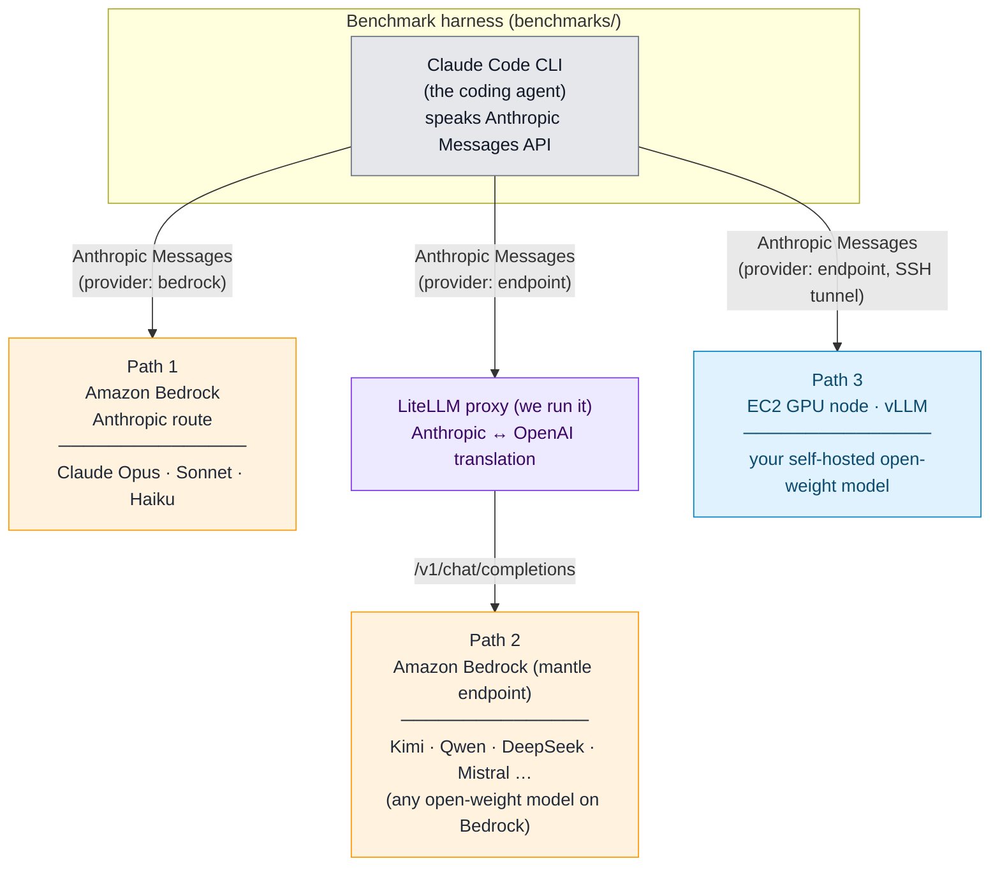

# The three hosting paths

Where the model runs and how the request reaches it. All three paths run the same agent, tasks, skill and scoring.

## The three hosting paths

Whichever path you choose, the agent (Claude Code), the tasks, the `/swe` skill, and the scoring are identical -- only *where the model runs and how the request reaches it* changes.

| | Path 1 - Anthropic on Bedrock | Path 2 - open-weight on Bedrock (LiteLLM) | Path 3 - self-hosted on EC2 (vLLM) |
| --- | --- | --- | --- |
| **Which models** | Anthropic family (Claude Opus, Sonnet, Haiku) | Any open-weight model on Bedrock (Kimi, Qwen, DeepSeek, Mistral, GLM, …) | Any open-weight model you can serve (Qwen3-Coder, GLM, Kimi, …) |
| **Where the model runs** | Amazon Bedrock | Amazon Bedrock | Your EC2 GPU instance |
| **How Claude Code reaches it** | Directly, native Anthropic route | Through a [LiteLLM](https://github.com/BerriAI/litellm) proxy we run that translates Anthropic ↔ OpenAI | Directly to your vLLM server (over an SSH tunnel) |
| **Cost model** | Pay-per-token | Pay-per-token | Fixed hourly GPU cost |
| **Extra infrastructure** | None | The LiteLLM proxy ([one script](../benchmarks/scripts/bedrock-mantle-proxy.sh)) | An EC2 GPU node running vLLM |
| **Best for** | Benchmarking the Anthropic family | Model variety with zero infrastructure to manage | Data sovereignty, air-gapped, and high-volume workloads where fixed GPU cost beats per-token pricing |
| **Operational guide** | [Path 1](../benchmarks/docs/path-anthropic-on-bedrock.md) | [Path 2](../benchmarks/docs/path-open-weight-on-bedrock-litellm.md) | [Path 3](../benchmarks/docs/path-self-hosted-vllm.md) |

The key enabler for Path 2 is the LiteLLM proxy. Claude Code speaks the [Anthropic Messages API](https://docs.aws.amazon.com/bedrock/latest/userguide/inference-messages-api.html), which on Bedrock reaches **only** Claude/Anthropic models; the open-weight models are reachable only through Bedrock's OpenAI-compatible [`bedrock-mantle` endpoint](https://docs.aws.amazon.com/bedrock/latest/userguide/inference.html) (Chat Completions). The proxy sits between the two and translates in both directions, so **any open-weight model on Bedrock can be wired into Claude Code** without changing the agent. All 38 third-party models on `bedrock-mantle` support tool calling and streaming.

---

[< Back to the README](../README.md)
