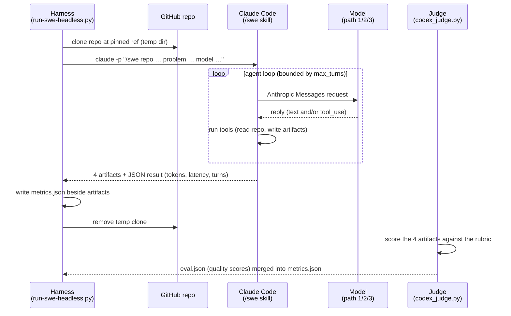

# What a single benchmark run does

One task from start to finish: clone the repo, drive the agent, record the metrics, score the artifacts.

## What a single benchmark run does

The flow below is identical across all three paths; only the box the request lands in (Bedrock's Anthropic route, the LiteLLM proxy, or your vLLM server) changes.

The `/swe2` and `/swe3` skills land **six artifacts** -- four design docs plus the implemented change (`patch.diff`, `implementation.md`) -- but they do **not** run tests or open PRs; whether the design and code are any good is the downstream evaluation the judge (or a human) performs on the artifacts. Full mechanics are in the [harness reference](../benchmarks/docs/harness-reference.md).

> **"SWE" here means software engineering in general -- not [SWE-bench](https://www.swebench.com/), the specific benchmark dataset.** The `/swe` skill lets you run any model against any task in any repo of your choosing. It is a *harness*, not a fixed benchmark set: compare results across models on the same task, or a single model across tasks of varying difficulty.

---

[< Back to the README](../README.md)
