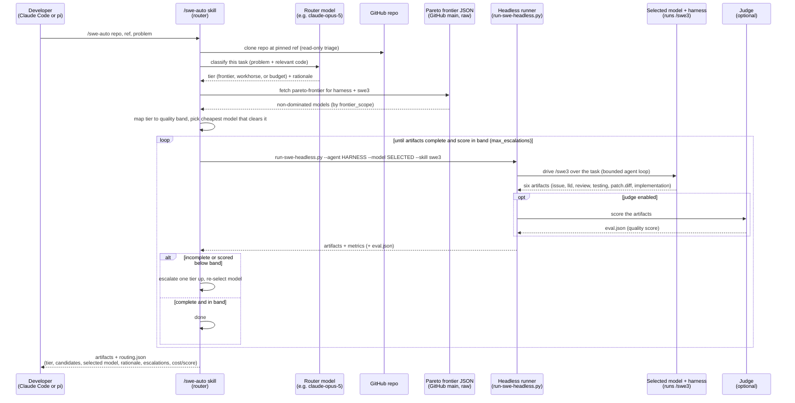

# The vision: a cost-aware coding harness that routes across the frontier

This repository measures a [cost/quality Pareto frontier](../README.md#results-a-worked-example) -- the set of models where nothing else is both better and cheaper. Building that frontier is not the end goal. It is the **lookup table** for the thing we actually want to build: a coding harness (or agent) that, given a task, **intelligently picks the right model from the frontier for that task** -- and switches models mid-task when the situation changes -- so a developer gets frontier-level results at workhorse-level cost without ever having to think about model selection.

## The problem this solves

Today a developer picks one model and uses it for everything. That is wasteful in both directions:

- Using a **frontier model** (e.g. Claude Opus) for every step is expensive -- most of a coding task is routine work a cheaper model does just as well.
- Using a **budget model** for everything risks quality -- hard planning, subtle correctness, and thorny debugging are exactly where the cheap model falls short, and you often do not find out until the work is already going wrong.

The frontier this repo measures says these are not either/or choices. Different models win in different regions of the cost/quality plane, and different *phases of a single task* live in different regions.

## What the harness would do

Given a task, the harness classifies it and routes each phase to the cheapest model on the frontier that clears the quality bar for that phase:

- **Plan with a frontier model.** Decompose the problem, write the design, decide the approach -- the high-leverage step where quality matters most and token volume is smallest, so paying frontier prices here is cheap in absolute terms.
- **Execute with an appropriate open-weight model.** Generate the artifacts and land the code with a **workhorse** (mid-frontier, e.g. GLM-5.2 / Kimi) or a **budget** model (e.g. a 3B-active MoE at ~$1/task) -- this is the bulk of the tokens, so this is where routing saves real money.
- **Escalate when it matters.** The developer can always ask the harness to switch back to a frontier model; and the harness can decide *on its own* that a run is going badly -- "my initial assessment was wrong, this is harder than it looked" -- and escalate mid-task before it wastes a budget model's turns on something it cannot finish.

The result: the developer states a task and a budget posture ("cheap", "balanced", "best"), and the harness handles model selection and switching underneath. Three tiers -- **frontier**, **workhorse**, **budget** -- picked and swapped per task and per phase, automatically.

## The first concrete step: `/swe-auto`

The first slice of this vision is **`/swe-auto`** -- a router skill that runs on **either Claude Code or pi**. The developer does not choose the model. Given a repo + ref + problem, a configurable **router model** triages the task read-only, classifies it as **frontier / workhorse / budget**, consults the measured [cost/quality Pareto frontier](../README.md#results-a-worked-example) to pick the cheapest non-dominated model that clears that tier's quality band, then shells out to the existing headless runner to run the **`/swe3`** skill with the selected model and harness -- producing the six artifacts (and, optionally, an `eval.json`). If the first pick fails to complete or scores below its band, it escalates one tier and re-runs, bounded by `max_escalations`.

The key design decision: the skill does the triage and frontier lookup **inline** (cheap), then **executes via `run-swe-headless.py`** rather than spawning a subagent -- so the same executor path works whether the router runs under Claude Code or pi (pi cannot fan out). Note the two independent harness choices: which agent runs the *router skill*, and which agent the *executor* drives `/swe3` under (`--agent`); they can match or differ.

The sequence below shows one `/swe-auto` invocation end to end -- launch, triage, frontier lookup, execution, optional scoring, and the escalation loop:

## Why this repo is the foundation

You cannot route intelligently without knowing, per model:

1. **How good it is** -- the quality benchmark (judge scores, and the [per-dimension breakdown](../README.md#quality-by-dimension-where-models-are-strong-or-weak) that tells you *which kinds* of work each model is reliable at).
2. **What it costs** -- the throughput benchmark, turned into a hardware-derived [cost per task](cost-per-task-methodology.md).
3. **Where it sits relative to every other model** -- the Pareto frontier that combines the two.

That is exactly what this harness produces today. The routing agent is the next layer built on top of it. Every model we add and every sweep we run sharpens the table the router will read.

## Status

The measurement half -- quality benchmarking, throughput benchmarking, and the combined frontier across three hosting paths -- is what exists in this repo now. The routing agent described above is the direction this work is heading, not a shipped feature; its first concrete slice is tracked as `/swe-auto` -- per-task routing that picks one model for the whole task and escalates a tier between runs. Per-*phase* routing (plan with a frontier model, execute with a workhorse) and in-flight mid-run model switching are later steps that build on it. This document is the north star that the benchmark harness is built to serve.
